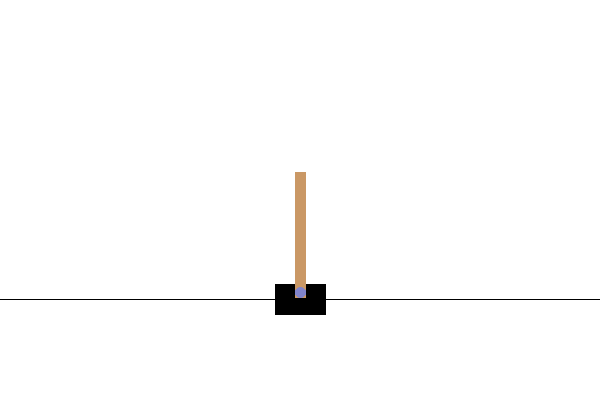
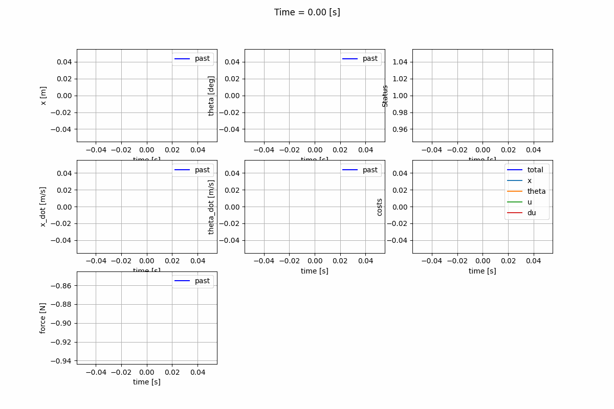
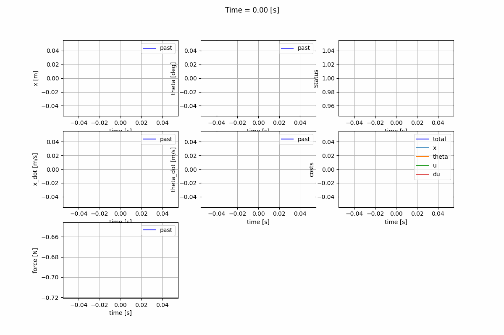
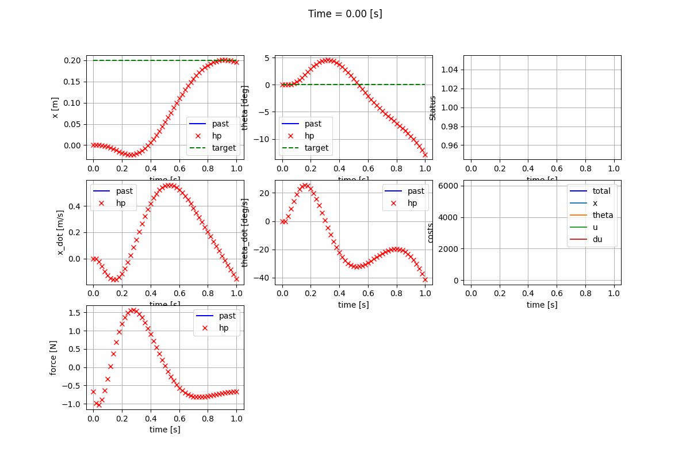
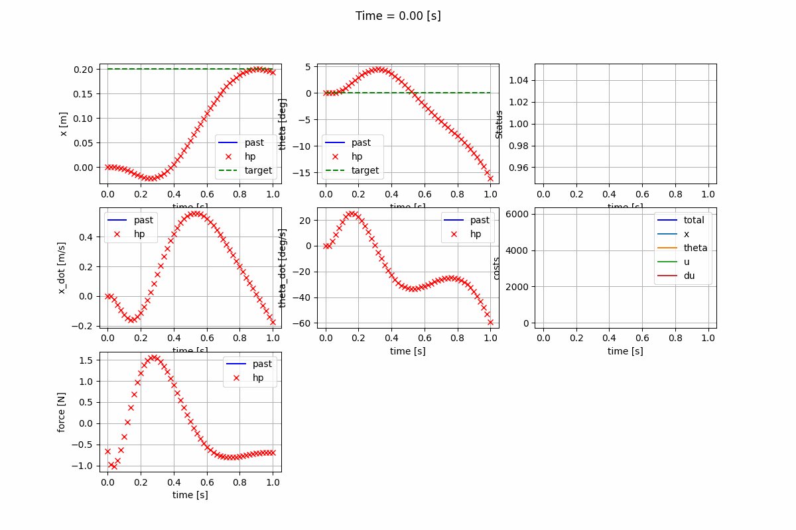
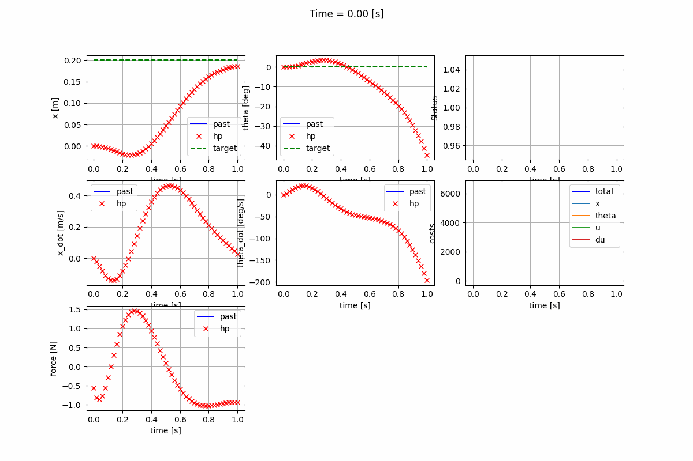

# Control of the Cart-Pole System

Implementation of control algorithms for the cart-pole system, including Nonlinear Model Predictive Control (NMPC), Linear Quadratic Control (LQR), and Linear Model Predictive Control (LMPC). 

<p align="center">
  
</p>

## Implemented Controllers

1. Linear Quadratic Regulator (LQR)
   - Infinite-horizon using Continuous Algebraic Riccati Equation (CARE)
   - Infinite-horizon using Discrete Algebraic Riccati Equation (DARE)
   - Finite-horizon LQR

   | Infinite-horizon LQR (CARE) | Infinite-horizon LQR (DARE) | Finite-horizon LQR |
   |:---------------------------:|:---------------------------:|:------------------:|
   |  |  |  |

2. Linear Model Predictive Control (LMPC)
   - Unconstrained LMPC with analytical solution
   - Constrained LMPC using Quadratic Programming (QP) solver

   | Unconstrained LMPC | Constrained LMPC |
   |:------------------:|:----------------:|
   |  |  |

3. Nonlinear Model Predictive Control (NMPC)

   | Nonlinear Model Predictive Control (NMPC) |
   |:------------------------------------------:|
   |  |


## Preparation

### Install Ipopt solver:
   1. Download `Coin-HSL Archive` (free for personal use)
   2. Install HSL solvers following instructions in `ThirdParty-HSL`
   3. Alternatively, use MUMPS solver by following instructions in `ThirdParty-MUMPS`
   4. Install Ipopt following provided instructions
   5. Install CppAD following provided instructions

### Test dependencies
The cart-pole env in gymnasium was used for visualization. Test if visualization is set up correctly. 
```
python3 ./vis/examples/test_vis.py
```

Test if the cart-pole plant (physical model) can run smoothly:
```
python3 -m system.plant --enable_vis
```

### Python Dependencies
Install required Python packages:
```
pip3 install -r requirements.txt
```

## Simulation

Build the project with cmake:
```
mkdir build && cd build
cmake ..
make -j4
```


How to run the simulation

```
python3 run.py --save_gif
```

## Settings
Settings of the controller type and parameter values are in the json file, `config/control_param.json`.  

```
"type": "NMPC",     // Available Types: "LQR", "LMPC", "NMPC"

"nmpc_cfg": {       // Control parameters for NMPC, active when "type" is "NMPC"
    "mpc_dt": 0.02,     // [s], NMPC time step
    "hp": 50,           // Prediction Horizon
    "hc": 50,           // Control Horizon, hc <= hp
    "Qx": 5000.0,       // Weight for tracking error of x
    "Qtheta": 100.0,    // Weight for tracking error of theta
    "R_u": 100.0,       // Weight for control effort (force)
    "R_du": 0.0         // Weight for control rate (force rate)
}

"lqr_cfg": {        // Control parameters for LQR, active when "type" is "LQR"
    "Qx": 5000.0,       // Weight for tracking error of x
    "Qtheta": 100.0,    // Weight for tracking error of theta
    "R_u": 1.0,         // Weight for control effort (force)
    "R_du": 0.1,        // Weight for control rate (force rate)
    "use_finite_lqr": true,  // If true, use finite horizon LQR solver; Otherwise, use infinite horizon LQR solver
    "hp": 50,           // Horizon, valid only if `is_finite` is true
    "lqr_dt": 0.02      // DARE step size, valid only if `is_finite` is true; Generally, `lqr_dt` = `ctrl_time_step`
    "use_dare": true    // For Infinite-Horizon LQR: If true, use DARE solver; Otherwise, use CARE solver
}

 "lmpc_cfg": {
    "mpc_dt": 0.02,
    "hp": 50,
    "hc": 50,
    "Qx": 5000.0,
    "Qtheta": 100.0,
    "R_u": 1.0,
    "R_du": 0.1,
    "is_unconstrained": false   // If true, use Analytical solution for unconstrained LMPC; 
                                // Otherwise, use QP solver for constrained LMPC
}

```
